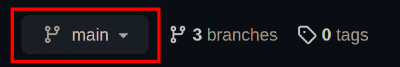
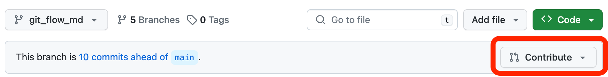

# SocialMeli

- [Trello](https://trello.com/b/wJBNHdHB/bejavahispw25g05)
- [Excalibur (Diagrama de clases)](https://excalidraw.com/#room=3525b414b8674fc9a010,4H2FJFBKAW5q2_6V6Tcg4w)
- [Especificación técnica funcional](https://www.google.com/url?q=https://docs.google.com/document/d/1Q-xGaOMPij-qk_gMvcN0Sk0isbCPqjJS/edit?usp%3Dsharing%26ouid%3D109742565608469686147%26rtpof%3Dtrue%26sd%3Dtrue&sa=D&source=editors&ust=1708099270823216&usg=AOvVaw2JhBoFP4pvFzUyAwHRjz3Z)

## A. Escenario y requerimientos iniciales (Desarrollo GRUPAL)
Mercado Libre sigue creciendo y para el año que viene  tiene como objetivo empezar a implementar una serie de herramientas que permitan a los compradores y vendedores tener una experiencia totalmente innovadora, en donde el lazo que los una sea mucho más cercano.

La fecha de lanzamiento se aproxima, por lo cual es necesaria la presentación de una versión Beta de lo que va a ser conocido como __"SocialMeli"__, en donde los compradores van a poder seguir a sus vendedores favoritos y enterarse de todas las novedades que los mismos posteen.

Para poder realizar esto, un analista funcional relevó una serie de requerimientos que deben llevarse a cabo; sin embargo, como cuentan con una determinada complejidad y los tiempos son escasos, deberán ser ejecutados en __equipos de trabajo__. Los mismos se detallan a continuación:

### Se plantea creación de una API Rest que permita:

1. Poder realizar la acción de “Follow” (seguir) a un determinado usuario
2. Obtener el resultado de la cantidad de usuarios que siguen a un determinado vendedor
3. Obtener un listado de todos los usuarios que siguen a un determinado vendedor (¿Quién me sigue?)
4. Obtener un listado de todos los vendedores a los cuales sigue un determinado usuario (¿A quién sigo?)
5. Dar de alta una nueva publicación.
6. Obtener un listado de las publicaciones realizadas en las últimas dos semanas, por los vendedores que un usuario sigue (para esto tener en cuenta ordenamiento por fecha, publicaciones más recientes primero).
7. Poder realizar la acción de “Unfollow” (dejar de seguir) a un determinado vendedor.

Por otra parte, dado que se pretende una buena experiencia de usuario con respecto a la forma de presentación de los resultados de cada consulta, se necesita que los mismos puedan ser ordenados mediante cualquiera de los siguientes criterios:

8. Alfabético Ascendente y Descendente
9. Fecha Ascendente y Descendente

Un analista funcional llevó a cabo el __relevamiento de los requerimientos técnicos funcionales__ y ha proporcionado la documentación que se cita a continuación para tener en cuenta a la hora de llevar a cabo el desarrollo correspondiente:

[Especificación técnica funcional](https://www.google.com/url?q=https://docs.google.com/document/d/1Q-xGaOMPij-qk_gMvcN0Sk0isbCPqjJS/edit?usp%3Dsharing%26ouid%3D109742565608469686147%26rtpof%3Dtrue%26sd%3Dtrue&sa=D&source=editors&ust=1708099270823216&usg=AOvVaw2JhBoFP4pvFzUyAwHRjz3Z)

## Git Flow

Supongamos que queremos trabajar en la feature US_0XX. Lo ideal sería seguir este procedimiento:
1. Crear rama correspondiente a la feature (En la terminal: `git checkout -b US_0XX`)
2. (Opcional) Pushear la nueva rama al repo (En la terminal: `git push origin US_0XX`)
3. Asegurarse de estar en la rama correspondiente (En la terminal: `git branch` y ver que el asterisco (*) este en la branch creada)
* Si no estas en la rama correspondiente, en la terminal cambiar con `git checkout US_0XX`
4. Codear los cambios como siempre
* Para pushear los cambios a tu rama __dentro__ del repo, usar `git push origin US_0XX`
5. Comiteamos los cambios en nuestra rama como siempre
6. Cambiar a la rama `dev` y hacemos pull para tener la version actualizada (En la terminal: `git pull origin dev`)
7. Ahora que `dev` esta actualizado, antes de mergear los cambios:
* Volver nuevamente a la branch que _queremos_ mergear (En la terminal: `git checkout US_0XX`)
* Mergear los cambios actualizados _desde_ `dev` _hacia_ la branch de la feature (En la terminal: `git merge dev`)
* Si surgen conflictos, solucionarlos en esta parte. Al terminar, por las dudas repetir pasos 6 y 7
8. Pushear la feature al branch que esta en el repo con `git push origin US_0XX`
9. Hacer un pull request para mergearlo al dev (No creo que haga falta revisiones, pero para ir acostumbrandonos)

### Abrir un Pull Request
Despues de pushear tus cambios, dentro del repo en GitHub clickear el boton __"Compare & pull request"__. Si aparecen varios botones, asegurarse de clickear el que corresponde a la branch de la feature nueva.

Si no se ve el boton, clickear el menu desplegable y seleccionar el branch correspondiente a la feature.

Una vez en la branch de tu feature, clickear el boton "Contribute" y luego en el boton "Open pull request".

Finalmente, asegurarse que se selecciona a `dev` como base para mergearlo _hacia_ `dev`.

