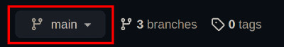
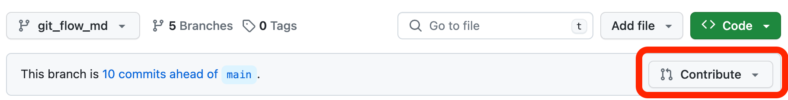
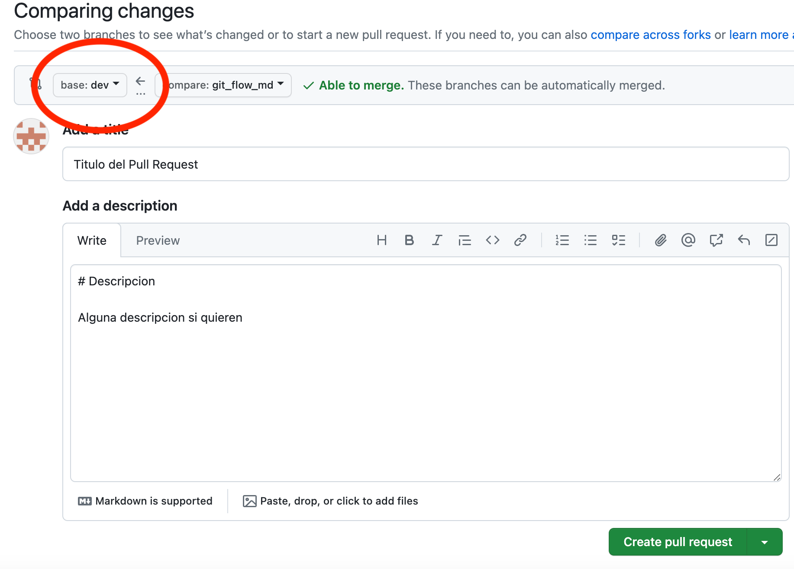

# SocialMeli

## Acceso rápido
- [Trello](https://trello.com/b/wJBNHdHB/bejavahispw25g05)
- [Excalibur (Diagrama de clases)](https://excalidraw.com/#room=3525b414b8674fc9a010,4H2FJFBKAW5q2_6V6Tcg4w)
- [Enunciado](https://learning.mercadolibre.com/courses/course-v1:it_prod+S2_esp+v1_2024/courseware/98996ace57964ee49eb38318393a6cd4/4115e03109fd476dbab0fc6cecc74e62/?activate_block_id=block-v1%3Ait_prod%2BS2_esp%2Bv1_2024%2Btype%40sequential%2Bblock%404115e03109fd476dbab0fc6cecc74e62)
- [Especificación técnica funcional - Sprint 1](https://www.google.com/url?q=https://docs.google.com/document/d/1Q-xGaOMPij-qk_gMvcN0Sk0isbCPqjJS/edit?usp%3Dsharing%26ouid%3D109742565608469686147%26rtpof%3Dtrue%26sd%3Dtrue&sa=D&source=editors&ust=1708099270823216&usg=AOvVaw2JhBoFP4pvFzUyAwHRjz3Z)
- [Especificación técnica funcional - Sprint 2](https://docs.google.com/document/d/1f-M02GbaXRYO_g3zfcFqzoxZaM7Lg5WY/edit)

### Condiciones y tiempos de entrega
- La fecha de entrega y cierre es: __01/03/2024__ hasta las __15:00 hs__.
- Nombre de la carpeta para entregar (grupal): __be_java_hisp_w25_g05__
- Nombre de la carpeta para entregar (individual): __be_java_hisp_w25_g05_apellido__

# Git Flow

Supongamos que queremos trabajar en la feature US_0XX. Lo ideal sería seguir este procedimiento:
1. Crear rama correspondiente a la feature (En la terminal: `git checkout -b US_0XX`)
2. (Opcional) Pushear la nueva rama al repo (En la terminal: `git push origin US_0XX`)
3. Asegurarse de estar en la rama correspondiente (En la terminal: `git branch` y ver que el asterisco (*) este en la branch creada)
* Si no estas en la rama correspondiente, en la terminal cambiar con `git checkout US_0XX`
4. Codear los cambios como siempre
* Para pushear los cambios a tu rama __dentro__ del repo, usar `git push origin US_0XX`
5. Comiteamos los cambios en nuestra rama como siempre
6. Cambiar a la rama `dev` y hacemos pull para tener la version actualizada (En la terminal: `git pull origin dev`)
7. Ahora que `dev` esta actualizado, antes de mergear los cambios:
* Volver nuevamente a la branch que _queremos_ mergear (En la terminal: `git checkout US_0XX`)
* Mergear los cambios actualizados _desde_ `dev` _hacia_ la branch de la feature (En la terminal: `git merge dev`)
* Si surgen conflictos, solucionarlos en esta parte. Al terminar, por las dudas repetir pasos 6 y 7
8. Pushear la feature al branch que esta en el repo con `git push origin US_0XX`
9. Hacer un pull request para mergearlo al dev (No creo que haga falta revisiones, pero para ir acostumbrandonos)

### Abrir un Pull Request
Despues de pushear tus cambios, dentro del repo en GitHub clickear el boton __"Compare & pull request"__. Si aparecen varios botones, asegurarse de clickear el que corresponde a la branch de la feature nueva.

Si no se ve el boton, clickear el menu desplegable y seleccionar el branch correspondiente a la feature.

Una vez en la branch de tu feature, clickear el boton "Contribute" y luego en el boton "Open pull request".

Finalmente, asegurarse que se selecciona a `dev` como base para mergearlo _hacia_ `dev`.

# Enunciado

## A. Escenario (Desarrollo GRUPAL)
__SocialMeli__, la nueva implementación de MercadoLibre que fue realizada por el equipo de desarrollo “Bootcamp” se ha convertido en ¡Todo un éxito!. Dado esto y a que MeLi tiene unos estándares de calidad muy altos con respecto a los productos de software que utiliza, estableció una serie de validaciones que considera que sean necesarias tener en cuenta a la hora de incorporar datos como así también diferentes test unitarios que aseguren el correcto funcionamiento de cada una de las funcionalidades que incluye.

Para llevar a cabo estas implementaciones, se deberá tomar como base el proyecto desarrollado de forma grupal en el Sprint Nº 1. A partir de él, se llevarán a cabo cada una de las validaciones y tests unitarios correspondientes.

Como documentación de respaldo, un analista funcional adjunta el siguiente documento de requerimientos técnicos y funcionales: [Documentación](https://docs.google.com/document/d/1f-M02GbaXRYO_g3zfcFqzoxZaM7Lg5WY/edit)

## B. Requerimientos incrementales (Desarrollo INDIVIDUAL)
Siguiendo con el principio de que __MeLi__ posee unos estándares de calidad muy altos, un especialista sugirió la posibilidad de contar con la implementación de al menos un test de integración para lograr una cobertura de código mayor que la lograda con los tests unitarios.

Tener en cuenta que, se debe respetar el desarrollo base logrado en equipo para poder realizar este nuevo incremento de manera individual.

## C. Bonus  (Desarrollo Individual EXTRA)
El mismo especialista en calidad que sugirió implementar al menos un test de integración anteriormente, sugiere que sería ideal lograr contar con la implementación de otros tests de integración extra para intentar lograr un __coverage mayor o igual al 75%__.

El especialista conoce que los tiempos de desarrollo en bootcamp son acotados, por lo que sugiere llevar a cabo esta implementación __solo en caso de que alcancen los tiempos__ y se pueda cumplir con la fecha de entrega estimada.
